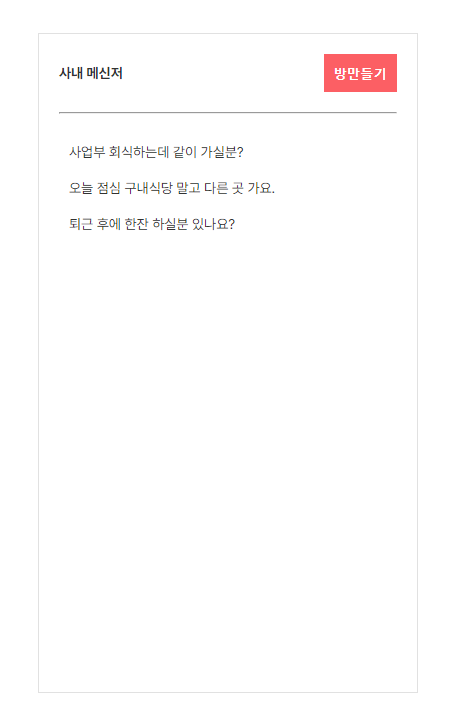
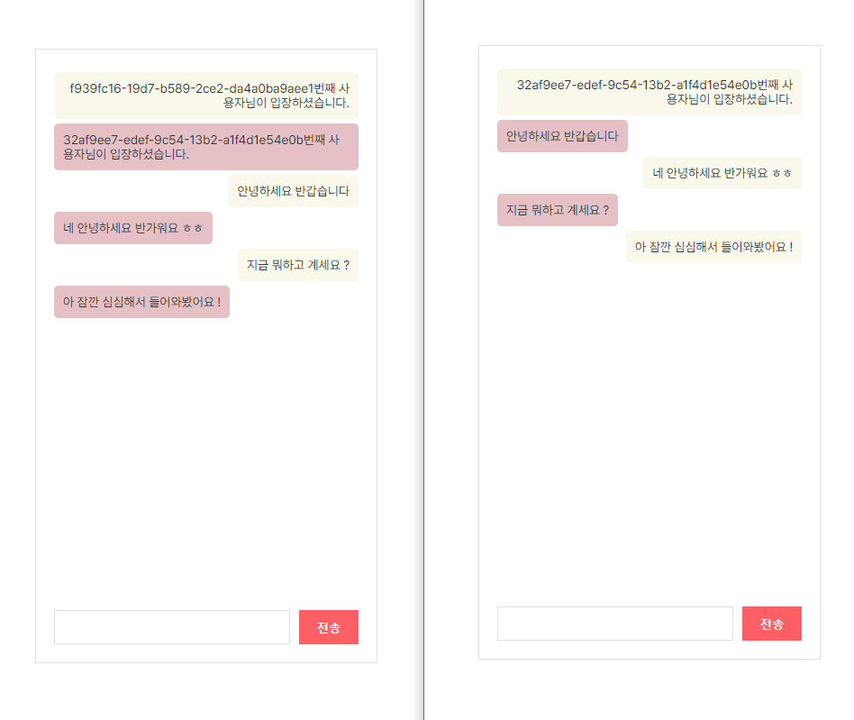

## Installation (React + TypeScript)

```javascript
// default
$ npx create-react-app 프로젝트명 --template typescript
$ yarn add react-router-dom
$ yarn add styled-components
$ yarn @types/styled-components --dev
$ yarn add @stomp/stompjs sockjs-client
$ yarn add @types/sockjs-client --dev
$ yarn add axios
$ yarn add @tanstack/react-query
$ yarn add react-uuid
```

## 👀 문득 궁금해서 웹 소켓을 써봤다 ,

<br />



<br />



<br />

UI 생각하기가 조금 귀찮아서 ( ... ) 한 10분정도만 <br/>
잠깐 끄적여서 형식적으로 틀만 잡고 <br/>
소켓 통신이 어떻게 이루어지는지에 집중했다. <br/><br/>
근데 생각보다 너무 간단하게 구현해 볼 수 있었음. <br/>
괜히 어렵게 생각했나 싶기도 하고. <br/><br/>
물론 DB 연동을 하기 시작하면 이리저리 꼬이기 시작할 것 같긴한데 <br/>
거기까지 구현하기엔 시간이 부족할 것 같아서 지금은 클라이언트 단에서 대충 처리했다. <br/><br/>
나중에 관련해서 깊게 들어가보기위해, <br/>
개념을 익혔던 코드를 그대로 기록하기 위해서 남겨보는 레포지토리.
